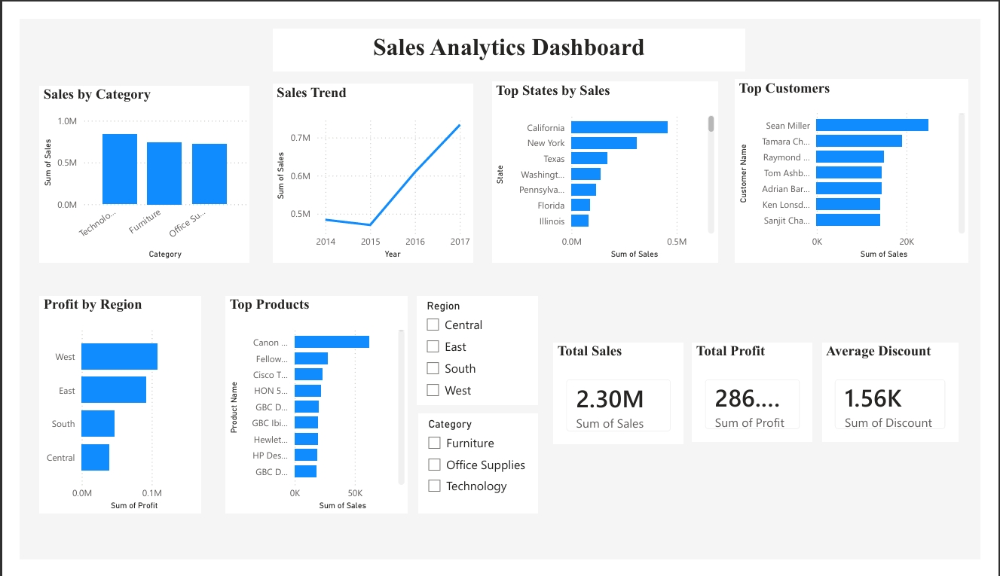

## Dashboard

Below is the Power BI dashboard created for this project.



---

## Project Workflow

1. Load the Superstore dataset.
2. Clean and preprocess the data using Python (Pandas).
3. Import the cleaned dataset into MySQL.
4. Perform SQL analysis to generate business insights.
5. Build an interactive dashboard in Power BI.
6. Visualize KPIs such as Sales, Profit, Category-wise Sales, Top Customers, Top Products, and Regional Performance.

---

## SQL Analysis

The project includes SQL queries for:

- Sales by Category
- Top Customers by Sales
- Profit by Region
- Top Profitable Products
- Top Customers by Profit
- Sales by Ship Mode
- Sales by State
- Monthly Sales Trend
- Category-wise Profit
- Average Discount by Category
- Top Cities by Sales
- Top Products by Sales

---

## Repository Structure

```
sales-analytics-dashboard/
│
├── dataset/
│   ├── Sample - Superstore.csv
│   └── cleaned_superstore.csv
│
├── etl/
│   └── clean_data.py
│
├── sql/
│   └── sales_queries.sql
│
├── screenshots/
│   └── dashboard.png
│
├── Sales_Analytics_Dashboard.pbix
├── requirements.txt
└── README.md
```

## Author

**Vignesh**
